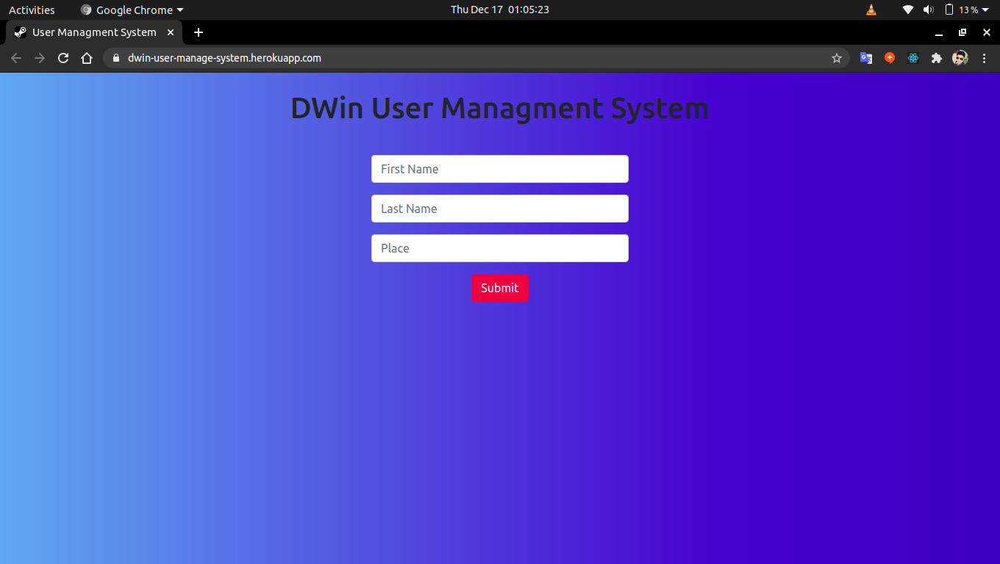
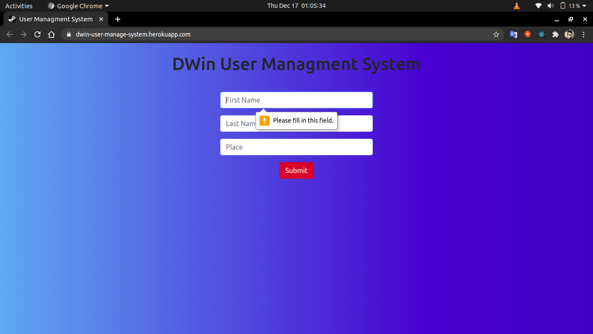
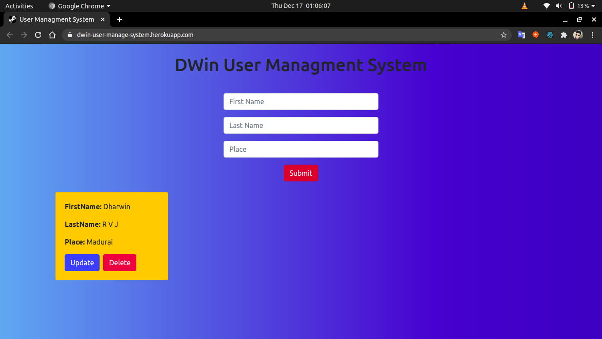
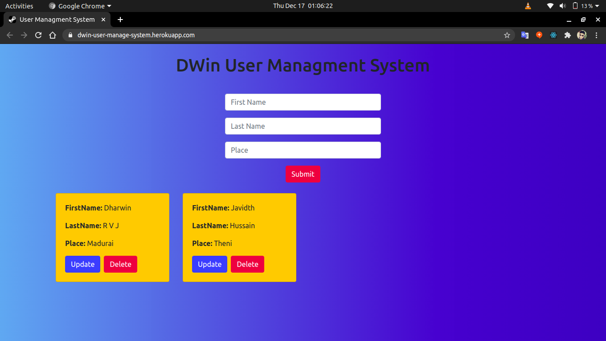
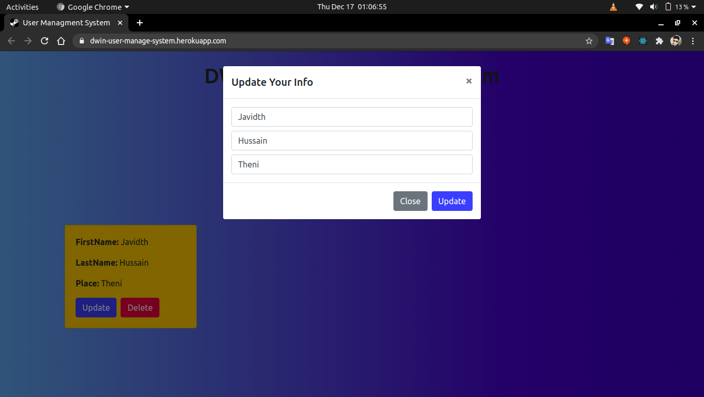
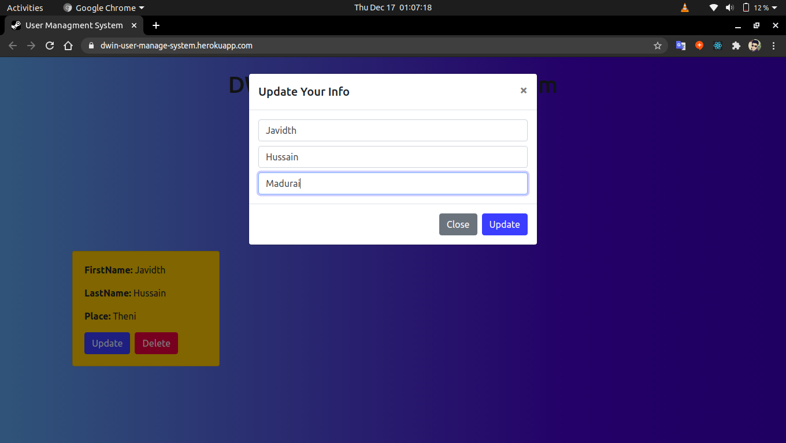

# user-manage-system
## MERN CRUD App
## Live Demo: https://dwin-user-manage-system.herokuapp.com
## For running my Application in your Local Machine,

```bash
$npm start
```
```bash
$cd client && npm start
```















